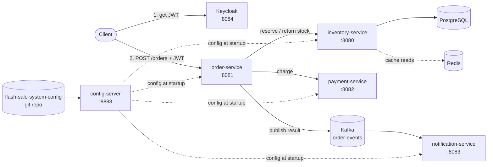

# Flash Sale System

[](https://github.com/riley-hendrickson/flash-sale-system/actions/workflows/ci.yaml)

A microservices backend for flash sales: limited stock, a burst of buyers, and a hard requirement that the system never sells more units than it has. Built with Spring Boot, Kafka, PostgreSQL, Redis and Keycloak, and runnable locally with a single `docker compose up`.

## Architecture



| Service | Port | Responsibility | Backed by |
|---|---|---|---|
| `order-service` | 8081 | Entry point. Orchestrates reserve → pay → publish, and compensates on failure. JWT-protected. | Kafka (producer), Keycloak |
| `inventory-service` | 8080 | Product catalog and atomic stock reservation/return. | PostgreSQL (Flyway), Redis |
| `payment-service` | 8082 | Simulated payment processor with configurable failure rates. | — |
| `notification-service` | 8083 | Consumes order events asynchronously. | Kafka (consumer) |
| `config-server` | 8888 | Spring Cloud Config server backed by [flash-sale-system-config](https://github.com/riley-hendrickson/flash-sale-system-config). | Git |

## How an order flows

1. The client authenticates with Keycloak and calls `POST /orders` with a bearer token.
2. `order-service` asks `inventory-service` to **reserve** the requested quantity.
3. If the reservation succeeds, it asks `payment-service` to **charge** the order.
4. If payment fails for any reason, it **returns the reserved stock** to inventory (a compensating action).
5. Whatever the outcome, it **publishes an `OrderEvent`** to the `order-events` Kafka topic, which `notification-service` consumes.
6. The client gets a specific result code and HTTP status, e.g. `201 SUCCESS`, `409 INSUFFICIENT_STOCK`, `409 PAYMENT_FAILED`, `503 PAYMENT_SERVICE_UNAVAILABLE`.

## Design decisions

**No overselling, without locks.** Stock is reserved with a single conditional update:

```sql
UPDATE Product p SET p.quantity = p.quantity - :requested
WHERE p.id = :id AND p.quantity >= :requested
```

The check and the decrement happen in one atomic statement, so there is no read-then-write race window and no need for pessimistic locks or optimistic-lock retries. If zero rows are updated, the service distinguishes "not enough stock" from "no such product". `InventoryConcurrencyIT` proves this against real PostgreSQL: 50 threads released simultaneously race for 20 units, and exactly 20 succeed, 30 get `INSUFFICIENT_STOCK`, and the final quantity is 0.

**Compensation instead of distributed transactions.** Reserve and pay span two services, so there is no shared transaction. Instead, `order-service` undoes the reservation if payment fails, which is a lightweight, orchestrated saga.

**Resilient service-to-service calls.** Every outbound call from `order-service` is wrapped in Resilience4j `@Retry` and `@CircuitBreaker`. Failed calls are retried; a persistently failing dependency trips the breaker so orders fail fast with a `503` instead of piling up behind timeouts. Fallbacks map each failure mode to a specific result code rather than a generic 500.

**Asynchronous notifications.** Publishing to Kafka keeps notification work off the order's critical path. The order service doesn't know or care who consumes events.

**Read caching.** Product reads are cached in Redis with Spring's `@Cacheable`, keeping browse traffic off the database during a sale.

**Security at the edge.** `order-service` is an OAuth2 resource server that validates Keycloak-issued JWTs. Placing an order requires authentication; browsing does not.

**Centralized, refreshable config.** Service settings such as the discount rate and simulated payment failure rates live in a separate git-backed config repo served by Spring Cloud Config, so they can change without rebuilding images.

## Tech stack

- **Java 21**, **Spring Boot 4.1** (Web, Data JPA, Kafka, Security / OAuth2 Resource Server, Cache)
- **Spring Cloud Config** for centralized configuration
- **Resilience4j** for retries and circuit breakers
- **PostgreSQL 14** with **Flyway** migrations
- **Redis 7** for caching
- **Apache Kafka 4** in KRaft mode (no ZooKeeper)
- **Keycloak 26** for identity and JWT issuance
- **Docker Compose** for local orchestration
- **JUnit 5, Mockito, Testcontainers, EmbeddedKafka** for testing
- **GitHub Actions** for CI

## Getting started

### Prerequisites

- Docker with Docker Compose
- Java 21 is only needed to run tests outside Docker

### Run the stack

```bash
git clone https://github.com/riley-hendrickson/flash-sale-system.git
cd flash-sale-system
docker compose up --build
```

On first startup Keycloak imports the `flash-sale-realm` from [`keycloak/`](keycloak/), so there is no manual identity setup. The realm includes:

| | |
|---|---|
| Realm | `flash-sale-realm` |
| Client | `flash-sale-client` (public) |
| Demo user | `test` / `test` |
| Admin console | http://localhost:8084 (`admin` / `admin`) |

These credentials are for local development only.

### Try it out

The examples below use bash. On Windows, run them in Git Bash or WSL.

Browse products (no auth required). Product 1 is seeded with only **3 units** to make stock contention easy to see.

```bash
curl http://localhost:8080/inventory
```

Get an access token for the demo user:

```bash
TOKEN=$(curl -s -X POST http://localhost:8084/realms/flash-sale-realm/protocol/openid-connect/token \
  -d grant_type=password -d client_id=flash-sale-client -d username=test -d password=test \
  | sed -E 's/.*"access_token":"([^"]+)".*/\1/')
```

Place an order:

```bash
curl -i -X POST http://localhost:8081/orders \
  -H "Authorization: Bearer $TOKEN" \
  -H "Content-Type: application/json" \
  -d '{"productId": 1, "quantity": 1, "orderId": "order-001", "amountDue": 99.99}'
```

Then watch the event arrive on the other side of Kafka:

```bash
docker logs -f notification-service
```

> **Expect failures, on purpose.** `payment-service` randomly fails a share of payments, at rates set in the config repo (`app.payment-failure-rate`, `app.processor-failure-rate`). You will see `PAYMENT_FAILED` responses, and after several processor errors the circuit breaker opens and orders return `503 PAYMENT_SERVICE_UNAVAILABLE` until it half-opens again. In each case the reserved stock is returned to inventory.

## API reference

| Method | Path | Service | Auth | Description |
|---|---|---|---|---|
| `POST` | `/orders` | order | JWT | Place an order. Body: `{productId, quantity, orderId, amountDue}` |
| `GET` | `/inventory` | inventory | — | List all products |
| `GET` | `/inventory/{productId}` | inventory | — | Get one product |
| `POST` | `/inventory/{productId}/reserve` | inventory | — | Reserve stock. Body: `{quantityRequested}` |
| `POST` | `/inventory/{productId}/return` | inventory | — | Return stock. Body: `{quantityReturned}` |
| `POST` | `/payments` | payment | — | Process a payment. Body: `{orderId, amountDue}` |

The reserve, return and payment endpoints are internal and are called by `order-service`; they are exposed on the host for local debugging.

## Testing

Each service is an independent Maven project. Run all of its tests (unit and integration) with:

```bash
cd inventory-service
./mvnw verify
```

`inventory-service` integration tests (`*IT.java`) start a real PostgreSQL container through Testcontainers, so Docker must be running. Kafka tests use an in-JVM embedded broker and need nothing extra.

| Area | Tests | What they cover |
|---|---|---|
| Concurrency | `InventoryConcurrencyIT` | 50 concurrent buyers for 20 units against real PostgreSQL: no overselling |
| Persistence | `ProductRepositoryIT` | Conditional reserve/return queries at the stock boundary and for missing products, against PostgreSQL |
| Resilience | `PaymentServiceClientCircuitBreakerTest`, `PaymentServiceClientRetryTest`, `InventoryServiceClientResilienceTest` | Breaker opens after repeated failures and rejects calls while open; retries run the configured number of attempts before falling back; an unreachable service maps to `SERVICE_UNAVAILABLE` |
| Messaging | `OrderServiceKafkaTest`, `OrderEventListenerTest` | Order events are published, serialized and deserialized correctly across services |
| Orchestration | `OrderServiceTest` | Every reserve/pay outcome, including stock compensation when payment fails |
| HTTP contracts | `*ControllerTest`, `*ServiceClientTest` | Status codes and error mapping on both sides of each REST call |

**CI** runs `./mvnw verify` for all five services in parallel as a GitHub Actions matrix on every push and pull request to `main`, and uploads test reports when a build fails.

## Project structure

```
flash-sale-system/
├── .github/workflows/ci.yaml   # CI: matrix build and test per service
├── config-server/              # Spring Cloud Config server
├── inventory-service/          # Catalog and stock reservation (PostgreSQL, Redis)
├── order-service/              # Order orchestration, JWT-secured entry point
├── payment-service/            # Simulated payment processor
├── notification-service/       # Kafka consumer for order events
├── keycloak/                   # Realm export, imported on first startup
└── docker-compose.yaml         # Full local stack
```
